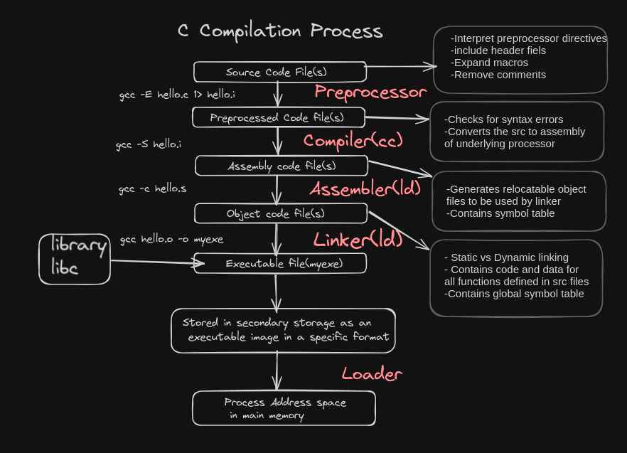
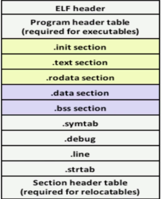
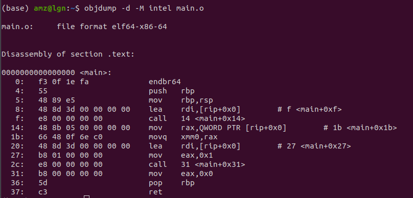

import CoolBear from '../src/components/CoolBear'
import CoolBearTip from '../src/components/CoolBearTip'
import SmartBear from '../src/components/SmartBear'


# Introduction


Ever wondered How C code compiles and runs 🤔 ?


In this blog, we will take a look at the C compilation process in details. We will start by explaining the different steps of the compilation process, then we will explain the different types of errors that can occur during the compilation process, and finally, we will explain the different types of files that are generated during the compilation process.

<p className="mt-10"></p>

<p className="mt-10"></p>

as you see in the picture above, the C compilation process is divided into 5 main steps:

1. Preprocessing
2. Compilation
3. Assembly
4. Linking
5. Execution

which we will explain in details in the following sections.

## Prerequisites

Before you start, make sure you have the following:

- a linux based operating system. If you don't have one, consider using a vm (virtual box or vmware or a remote machine that runs linux )
- GCC installed on your system. You can check this by running `gcc --version` in your terminal.
- Access to a Linux terminal. You can check your Linux kernel version by running `uname -a` in your terminal.

# Preprocessing

**preprocessing** isn't part of the code compilation itself but from the compilation process as a whole,it happens before compilation and done by a software component called **preprocessor** which interprets **directives** such as **#define**, **#include**.
remember that all directives starts with a **#** symbol.

there 4 main steps in the preprocessing phase:


1. **expanding macros**: the preprocessor replaces the macros with their values.
2. **expanding include directives**: the preprocessor replaces the **#include** directive with the content of the file.
3. **conditional compilation**: the preprocessor evaluates the **#if**, **#ifdef**, **#ifndef**, **#else**, **#elif**, **#endif** directives and includes or excludes the code based on the evaluation.
4. directives such as **#pragma** and **#undef** are also processed by the preprocessor.


create a **main.c** file and write the following :

```c Highlights=1,3,4
#include <stdio.h>

#define print_hello() printf("hello world\n")
#define PI 3.14

#ifndef PI
#define PI 3.1415 // this won't be executed since PI is already defined
#endif


int main() {
    print_hello();
    printf("PI value is %f\n", PI);
    return 0;
}
```

then run the following command to see the output of the preprocessing phase:

```shell
gcc -E main.c -o main.i
```

the first thing you will notice is that the **#include** directive is replaced with the content of the file **stdio.h** and the **#define** directives are replaced with their values and the main function now looks like this:

```c file=main.i
int main() {
    printf("hello world\n");
    printf("PI value is %f\n", 3.14);
    return 0;
}
```
<CoolBear>
you may wonder what is the use of the preprocessing phase, well,
this will help you to understand the code better and see the code that will be compiled. also, it will help you understand and build macros and conditional compilation directives.
</CoolBear>


# Compilation

the compilation phase is the phase where the **preprocessed** file is converted to an **assembly** file. the **compiler** is responsible for this phase.

there is a popular quote by compiler designers :

> "compile the compiler with the compiler. So it doesn't have problems it has"- unknown


the **compiler** is a software component that takes the **preprocessed** file and converts it to an **assembly** file.

to see the output of the compilation phase, run the following command:

```shell
gcc -S main.i -o main.s
```

<CoolBear>
By the way you can set the C standard using -std flag in the compilation command like you did `gcc -S main.i main.s -std=c11` and you can see all c standards in the man page, type `man 7 standards`.
you can also add debugging symbols to the assembly file using the `-ggdb` this will enable you to use the gnu debugger tool to see what's wrong with your code!
</CoolBear>

let's conitnue. This will generate a **main.s** file that contains the assembly code of the **main.i** file.

# Assembly

the assembly phase is the phase where the **assembly** file is converted to an **object** file.

the **assembler** who is responsible for this phase, takes the **assembly** file and converts it to a **Relocatable object file** of type **elf**.


to see the output of the assembly phase, run the following command:

```shell
gcc -c main.s -o main.o
```

this will generate a **main.o** file that contains the object code of the **main.s** file.

this **main.o** file is called a **relocatable** file because it contains the code and data sections of the **main.s** file and it will be merged with other **relocatable** files in the **linking** phase.

cool bear has something to say:

<CoolBear>
### locatable object file

**Relocatable object file** (.o file ) Contains binary code and data in a form that ca nbe combined with other relocatable object files at compile time to create an executable object file. Each .o file is produced from exactly one .c file. Compilers and assemblers generate relocatable object files.
the output of assembling phase is `main.o` file that contains
- this data and code sections' file will be merged with other data and code of other files in the linking phase
- it contains a symbol table
- name only of library functions using in source file.
by the way run this to see for yourself `file main.o`
you will get the following output:
 `main.o: ELF 64-bit LSB relocatable, x86-64, version 1 (SYSV), not stripped`
file is a command that displays the type of a file.


</CoolBear>


# Linking

this part is the boss of the compilation process, it's the phase where all the **relocatable** files are merged together to create an **executable** file.


<CoolBear>
**Executable object file** : (a.out file ) Contains binary code and data in a form that can be copied directly into memory and executed. Linkers generate executable object files.
</CoolBear>

relocatable files and executable files are both of type **elf**.

let's view the elf file structure:
<p className="mt-4"></p>



<p className="mt-4"></p>

the elf file contains the following sections:

- **header** : contains the elf file header.
- **text** : contains the executable code.
- **data** : contains the initialized data.
- **bss** : contains the uninitialized data.
- **symtab** : contains the symbol table.
- **strtab** : contains the string table.
- **debug** : contains the debugging information.
- **line** : contains the line number information.
- **shstrtab** : contains the section header string table.
- **init** : contains the initialization code.

## using readelf command
let's see the type and content in each section of the **main.o** file using the following commands:

```shell
file main.o
readelf -h main.o // to see the header
readelf -S main.o // to see the sections
```

## using objdump command

```shell
objdump -h main.o // to see the header
objdump -D main.o // disassembly of all sections
objdump -d main.o // disassembly of main only
objdump -d -M intel hello.o // intel format
```

**objdump** and **readelf** are tools to help you see the content of the elf files as well as the disassembly of the code in the desired architecture.
you may get something like this when running the disassembly using the intel format :




what you need to know for now is that programs you write in C are not standalone programs, they depend on other libraries like libc, libm, etc. and the linking phase is the phase where these libraries are linked to your program.
to view the **symbol table** of the **main.o** file, run the following command:

```shell
nm main.o
 ```
you will see something like this :
```shell
$ nm main.o 
                 U _GLOBAL_OFFSET_TABLE_
0000000000000000 T main
                 U printf
                 U puts

```
<CoolBear>
### Symbol Table
U : undefined symbol
T : text section symbol

in our program we have 3 symbols:
- **main** : the main function
- **printf** : the printf function
- **puts** : the puts function
- **_GLOBAL_OFFSET_TABLE_** : this is a special symbol that is used in position-independent code (PIC) to access global variables in shared libraries.
- **U** : means that the symbol is undefined and will be resolved in the linking phase.
- **T** : means that the symbol is defined in the text section.

</CoolBear>

to see the output of the linking phase, run the following command:


```shell
gcc main.o -o main
```

finally, you will get an executable file named  *main** that contains the executable code of the **main.o** file.

let's see the symbol table of the **main** file again:

```shell
nm main
```

there are a lot of symbols in the **main** file, but the most important ones are the **main** function and the **printf** and **puts** functions.
```shell
0000000000001169 T main
                 U printf@@GLIBC_2.2.5
                 U puts@@GLIBC_2.2.5
```

printf and puts are still undefined because they are loaded from the libc library dynamically at runtime. we will talk about that in a later blog posts.
but what i want you to retain is that it knows where to find the **main** function in the **main** file. so at run time, the **main** functions will be executed from the libc library.


# Execution

the last phase of the compilation process is the execution phase, this is the phase where the **executable** file is executed.

to execute the **main** file, run the following command:

```shell
./main
```

Congratulations 🎉 ! you made it to the end. let's say what you have learned in this blog post:

- the stages of the C compilation process which are **preprocessing**, **compilation**, **assembly**, **linking**, and **execution**.
- the different types of files that are generated during the compilation process.
- the elf file structure and the different sections of the elf file.
- the different tools that can be used to view the content of the elf files and the disassembly of the code such as `readelf`, `objdump`.
- use of `nm` command to view the symbol table of the elf files.


<SmartBear props="flex-row-reverse">
So, how C code compiles ?
</SmartBear>

<CoolBear>
What you need to know for now is that your code rides a roller coaster of different phases before it becomes an executable file. and turning it into a process is another story! don't worry we are covering some of that here!
</CoolBear>

<SmartBear props="flex-row-reverse">
Sounds cool!
</SmartBear>