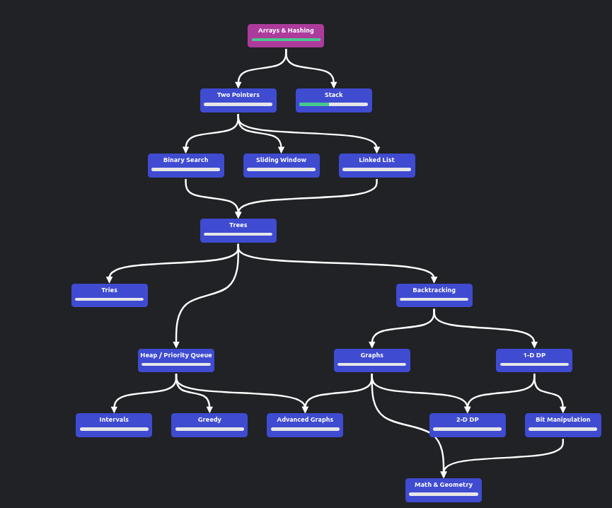
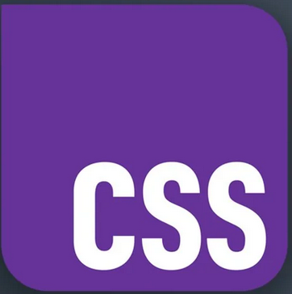

import SmartBear from '../src/components/SmartBear'
import CoolBear from '../src/components/CoolBear'
import SmartBearReverse from '../src/components/SmartBearReverse'
import CoolBearReverse from '../src/components/CoolBearReverse'

# Introduction

it's been about 4 years since i started doing problem solving. done some basic ones on hackerrank. most of my time after that was on codewars. codewars was one of the best sites i had that thought me coding and problem solving at that time. but that was only true only until discovering leetcode.
i have done some leetcoe two years ago. found it to be very hard, even easy ones seems to be tricky! days pasts, started needing to prepare for coding interviews and therefore the come back to leetcode was invertible. i hated my feelings and my ego being crashed by leetcode easy and medium problems. after hard time trying to understand my weaknesses, i can confidently cut them to three :
- choosing what data structure on favor of the other.
- converting thought proces to code lines.
- solving the problem in 30 minutes or less (most coding interviews are 30 minutes)

if you have these problems too, i will help you tackle them one by one.

# How to choose data structures

choosing the right data structures is tricky and dependes on the problem for sure. in order to know which data structure to use, you should first undertand them really well. therefore i present to you this very quick valuable resource.
[data structures & algorithms presented by  Gayle Laakmann McDowel](https://youtube.com/playlist?list=PLsn6T340evTTsIu-ziXa2-e58idI3kkl1&si=CI580fckmTThrRJC). i recommend that you first try implementing these yourself after understanding the concept so they stick with you. McDowel is the instructor and she is one of the best teachers in this era, i highly recommend her book, cracking the coding interview. exactly the parts of the big O if it didn't stick with you and the process to solve problems that we will explain in just a moment!

i want you after this to take on this 150 problems tree provided by [NeetCode](https://neetcode.io/roadmap)

there are couple of popular collections such as grind leetcode 75 but the beauty of this structures is that you will solve problems based on data structures, this means you mostly won't choose the ds yourself but this is exactly the goal. you will be able to grasp the similarities between problems and therefore you will be able to distanguish what ds to use and when.

# converting thought process to code lines. 

sometimes you get that aha! moment and start typing code, hopefully you will get there but after time elapses...
In order to translate the thought process to code lines you need to take babe steps and write them done in the pseudocode manner. this appraoch avoids some complexities that you might haven't had thought about before. 
i recommend doing the following, after you draw the algorithm in your head, don't yet write code. type it in papers as pseudocode and run it there! yes, run it on paper! so that when you check it works which is a lot more faster to do than typing it right away, you will know for sure that after that you code will pass the test!

# solving the problem in 30 minutes or less (most coding interviews are 30 minutes)

after solving perhaps more than 200 problems i come to the same conclusion the Professor Gayle Laakmann McDowel. you should always start by brut forcing the exercice.

- start with the brut force (easy, obvious and none optimized solutions)
- seek areas of optimizations according to the problem using the information provided by in the description
- after you get the optimized solution. test it in your papre for sure. you should have done everyting so far only on your paper.
- write pseudocode for exactly how you will implement the algorithm.
- write the algorithm in you specific language, it won't take you more than 5 minutes.

training on this method will help you reduce the amout of time taken to solve the problems. you will see a significant boost in your speed and you ability to translate ideas to code faster.

# conclusion

solving leetcode or perparing for job interviews is a matter of practice. So, don't feel inferior, or to belittle yourself. it only takes training. what are you wating for go get them! 

<CoolBear>
yea bro, took as time to get good at leetcode. i couldn't believe i'm solving hard easy now!
</CoolBear>

<SmartBearReverse>
yes. it only takes practice, it only takes practice.
</SmartBearReverse>

<CoolBear>
have you seen the new Css logo!

the color is rebeccapurple!

</CoolBear>

<SmartBearReverse>
Cooool! the new features are cooler and we might talk about it if you wish!
</SmartBearReverse>