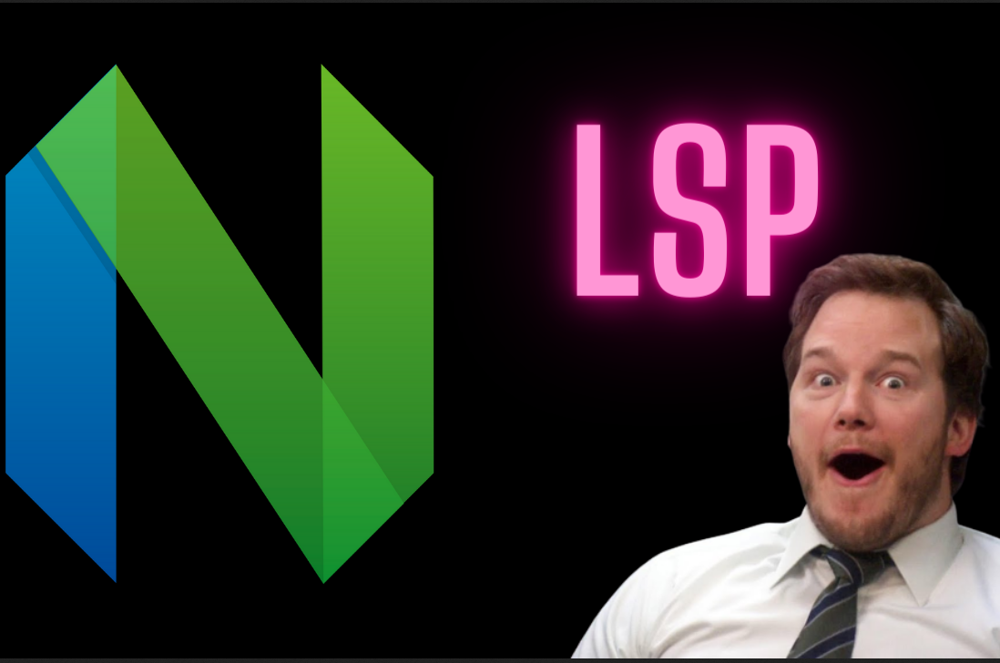

import SmartBear from '../src/components/SmartBear'
import CoolBear from '../src/components/CoolBear'

# Introduction

<p className="mt-4 mb-4"></p>



<p className="mt-4 mb-4"></p>

here is a question that i want you to think about. what makes the difference between a code editor and a sample text editor? 🤔
is it the theme? the font? the colors? if so, then microsoft word is a code editor 😅. Your editor or IDE prvides all the features that you need to write code, like syntax highlighting, code completion, and error checking through the from **language servers** using the **language server protocol ** or **LSP** for short.
in today's blog, we are answering the 6 WH questions about LSP in under 10 minutes which are :

- What is LSP?
- Who LSP ?
- Why LSP?
- When LSP?
- Where LSP ?
- How LSP?


# What is LSP?

**LSP** or **language server protocol** is a protocol that defines how an **editor** (client) and a **language server** (server) communicate with each other so that language server can provide **language-specific features** to the **editor** such as **auto-completion**, **go to definition** etc.


# Who LSP?

the language server protocol is created by Microsoft, alongside some collaboration with Red Hat and Codenvy.

# When LSP?

it was open-sourced in 2016 and gained a lot of popularity starting from 2020.

# Where LSP?

it happens in your editor!

when you add lsp plugins to your editor like **rust-analyzer** , **gopls** or any other language server, when you lunch your editor, it will start the language server as a seperate process and communicate with it through standard input and output (mostly but not always!).
when you shut down your editor, the language server will also shut down. so, your editor owns that server process for its entire life cycle.
at each keystroke, the editor sends a message to the language server to keep it updated with the latest changes in the code and expects **LS** to respond with whatever the user needs to know about the state of their codebase.

# Why LSP?

protocols always are to turn an **M*N** problem into an **M+N** problem. in our case, **M** is the number of editors and **N** is the number of Language servers.
instead of LS providers trying to understand how each popular editor works to provide language support for that editor or the editor makers wanting to add support for some language servers to understand how they work? they will adapt the same interface (protocol) to make sure everyone does his job correctly and ensure seamless integration and support for all languages and editors.
so editor makers write a **lsp client** once, and the language makers write **language server** once, and they can work together no matter what!


# How LSP?

it's doing quite well, thanks for asking 😂. seriously, how Lsp? let's read the together to discover how ourselves in this link !
all right, the request follows a specific format where you have a **header** which contains (**Content-Length**) and a **\r\n** and a **\r\n** for the **content type** and another **\r\n** for the **content**.
content length is obligated to be sent but the content type is optional. the content itself is sent using **json-rpc** format. like the following 

generally something like this :

```
Content-Length: ...\r\n
\r\n
{
"jsonrpc": "2.0",
"id": 1,
"method": "textDocument/completion",
"params": {
...
}
}

```

here is an example of a request sent to your language server when you open a file in your editor for the rust language :
```
json
    {
        "jsonrpc": "2.0",
        "id": 1,
        "method": "textDocument/didOpen",
        "params": {
            "textDocument": {
                "uri": "file:///path/to/file",
                "languageId": "rust",
                "version": 1,
                "text": "fn main() {\n    println!(\"Hello, world!\");\n}\n"
            }
        }
    }
```

now, let's see the sequence of events that happen when you open a file in your editor :

1. the editor sends an **initialize** request to the server.
2. the language server sends back an **initialize** response to the editor which contains the **capabilities** of the server and its **version**.
3. the editor sends a **didOpen** notification to the server.
4. afterward, the client sends to the server anything listed in its capabilities to see if it can help with that.
5. when they finish, the editor sends a **shutdown** request to the server.
6. the client sends an **exit** notification to the editor.


here is an implementation i did in **go** lang. you can find it here [lsp implementation](https://github.com/abderrahimAMZ/lsp)

# Bears tea talk

<SmartBear>

There is this lsp i can lunch , let's go! 🚀, let's send `initialize` request to see what this server does`

</SmartBear>

<CoolBear>

oh, hi Mr editor, how are you doing?
I'm a language server, i'm version 1.0, and here are my capabilities, let's work together 🤝
- auto-completion
- go to definition
- hover

</CoolBear>


<SmartBear>

Amazing. Apparently, this server has a lot to offer! the user oppened a file the lsp server can help with, let's send `didOpen` notification to the server.

</SmartBear>

<CoolBear>

oh, this is a lot of code here, let's see what's going on here! 🕵️‍♂️

</CoolBear>

<SmartBear>

the user is typing, let's send `textDocument/didChange` notification to the server.

</SmartBear>

<CoolBear>

oh, i see you are typing, amazing, i'm keeping up with you! 🏃‍♂️

</CoolBear>

<SmartBear>

the user is asking for auto-completion, let's send `textDocument/completion` request to the server.

</SmartBear>

<CoolBear>

sorry, i have no idea of what you want! 🤷‍♂️

</CoolBear>

<SmartBear>

the user is asking for go to definition, let's send `textDocument/definition` request to the server.

</SmartBear>

<CoolBear>

i have no idea where i can find this definition! 🤷‍♂️

</CoolBear>

<SmartBear>

are you really an lsp server? 🤔

</SmartBear>


