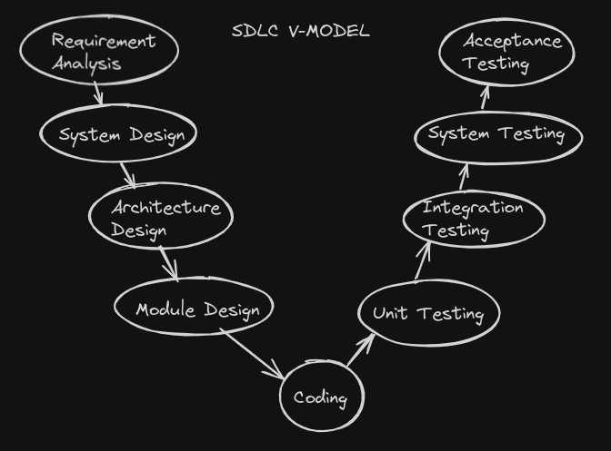

# Introduction

Hi everyone 👋,

In this article, I will explain to you the SDLC-V model and how it works in the embedded development world in under 10 minutes ⏳

## What is SDLC-V model ?

the V model is a Software development life cycle (SDLC) model. It is based on the association of a testing phase for each corresponding development stage. The development of each step is directly associated with the testing phase.
The next phase starts only after completion of the previous phase i.e., for each development activity, there is a testing activity corresponding to it.

it provides a systematic and visual representation of the software development process. It is based on the idea of a “V” shape, with the two legs of the “V” representing the progression of the software development process from requirements gathering and analysis to design, implementation, testing, and maintenance.

## Why SDLC-V model ?

The V model is a highly disciplined model. It is preferred  in the embedded development world because of it being  strict model. it is not suitable for projects where requirements are at a moderate to high risk of changing. So, it is suitable for projects where requirements are well defined and static.
so if you think you may change things in your project again 👨‍💻, you should reconsider your decision in using the V model 🤭

# SDLC-V model phases

## Requirements analysis

here, we need to write what's called SRS (Software Requirements Specification) or ERS (Embedded Requirements Specification) document ✍️. which is a document that completely describes what our client wants following the IEEE standard. check the standard [here](https://ieeexplore.ieee.org/document/159342)

## System design

this phase helps in specifying hardware and system requirements and also helps in defining overall system architecture.

## Architecture design

In this stage, architectural specifications are comprehended and designed. Usually, a number of technical approaches are put out, and the ultimate choice is made after considering both the technical and financial viability.

## Module design

This phase, known as Low Level Design (LLD), specifies the comprehensive internal design for each and every system module. Compatibility between the design and other external systems as well as other modules in the system architecture is crucial

## Implementation

we, as embedded developers, we code to fulfill the modules were created during the design phase 🤓

## Unit testing

in this phase, we test each module separately to ensure that it works as expected.

## Integration testing

in this phase, we simply test the integration of the modules to ensure that they work correctly together.

## System testing

System testing test the complete application with its functionality, inter dependency, and communication.

## Acceptance testing

UAT is performed in a user environment that resembles the production environment. UAT verifies that the delivered system meets user’s requirement and system is ready for use in real world.

# SDLC-V model advantages

1. Each phase has specific deliverables.
2. Higher chance of success over the waterfall model due to the development of test plans early on during the life cycle.
3. clearly defined stages.

# SDLC-V model disadvantages

1. least flexible.
2. Software is developed during the implementation phase, so no early prototypes of the software are produced.
3. Problems may be discovered during the testing phase which may require rework of the previous phase.

