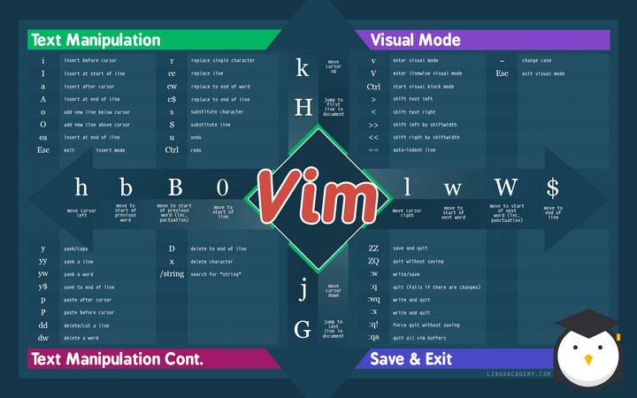
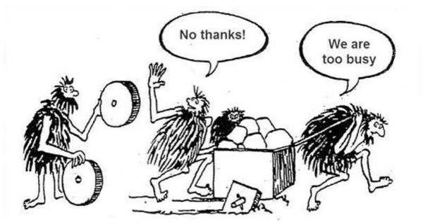

# What is Vim motions?




as you see in the picture. vim motions are a set of modes. each mode has its own set of commands that allow you to move around your file, select text, copy, paste, delete, and more. it is the way for maximum productivity in your dev environment.
not only that. vim motions has a more powerful features such macros! you can record your actions and replay them whenever you want. this is a game changer for me. 

# Why Vim motions?



don't be busy to improve!
vim motions is  the thing that when you learn, you want to use everywhere. it's even included in my favorite note-taking software which is [obsidian](https://obsidian.md/) which might be another subject for another article.
vim motions will increase your productivity simply because you minimize the travel to your mouse. in addition, what realize actions that you do frequently with the mouse in a fraction of a second.

take this scenario as an example.

```python

# you have a list of items that you get from a website and you want to add "" to each item.

list_of_items_before = [
    item1,
    item2,
    item3,
    item4,
    item5
    ];

list_after = [
    "item1",
    "item2",
    "item3",
    "item4",
    "item5"
];

```
doing this edit in vim motions using what's known as macros would raughly take 5 seconds whereas doing it with the mouse would take 15 seconds. and this is a simple example. imagine doing this with a 1000 items list. you will save a lot of time.
what if you have 100 items or 1000. and this is just a simple example of what you can do with vim motions.

# Vim motions Vs Vim editors

don't confuse the two. vim motions are the set of commands that allow you to move around your file, select text, copy, paste, delete, and more. while vim editors are the software that you use to write your code. the most popular one is [neovim](https://neovim.io/).


# Requirements 

- you should be able first to type without looking at the keyboard. otherwise, you learning vim motions will be useless.
- patience. you will need to gradually adapt to it. i recommand using neovim for 10 to 30 minutes a day for a week. and then when you get okey with the tool, start using it inside your favorite editor. there is always a plugin for it.


# Recommended resources

- ben award has an excellent 1-hour minutes YouTube video explaining the basics and beyond of vim motions. check it out here [vim motions explained](https://www.youtube.com/watch?v=IiwGbcd8S7I)
- the primegean has a playlist teaching vim motions and neovim configuration which is something you may want to play with. check it out here [vim motions and neovim configuration](https://www.youtube.com/watch?v=X6AR2RMB5tE&list=PLm323Lc7iSW_wuxqmKx_xxNtJC_hJbQ7R&ab_channel=ThePrimeagen)
- here one of my favorite channels i watch around vim editor and learning motions by the terminal. check it out here [typcraft](https://www.youtube.com/@typecraft_dev)


# Conclusion

go learn. what are you waiting for!